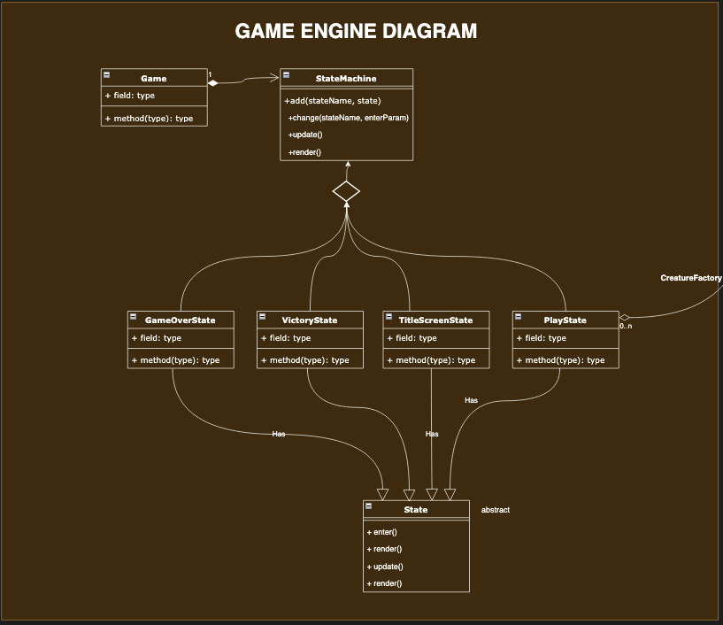
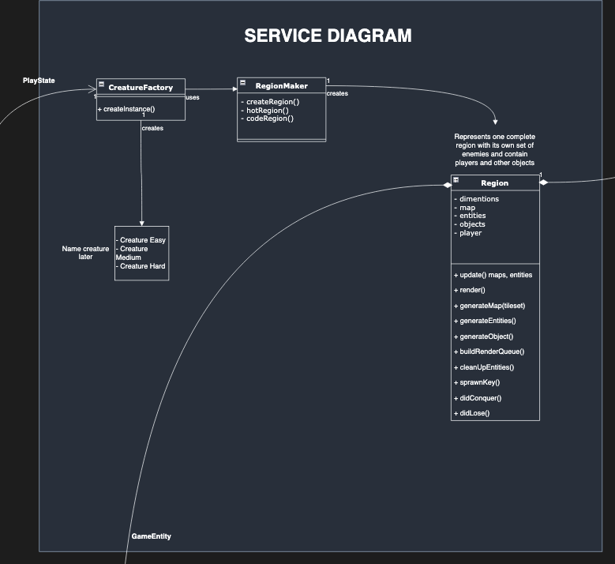
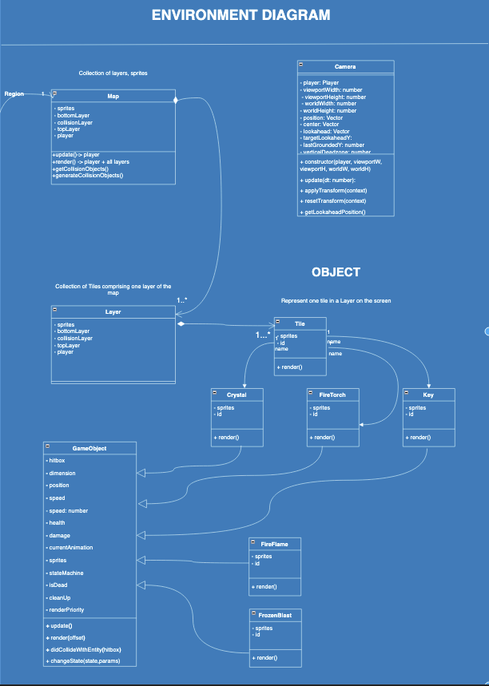
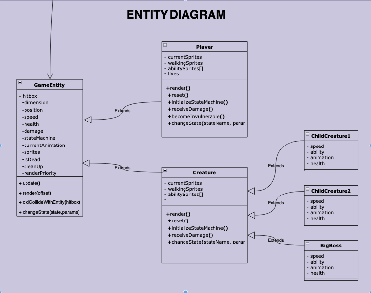
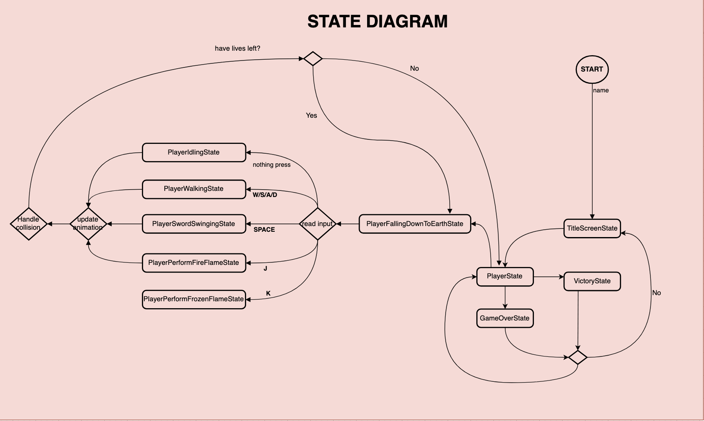
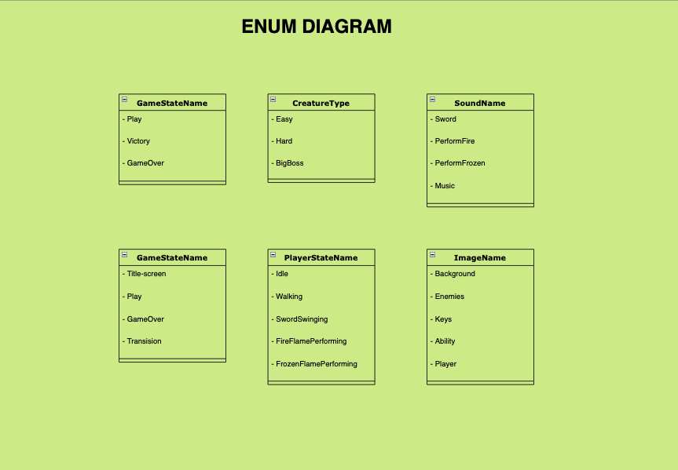

# 🎮 Game Design Document — Zelda-Inspired JS Game
### 📌 Overview
The game draws strong inspiration from the survival-adventure spirit of Jumanji storyline, with the  where characters are trapped into a dangerous, unpredictable game world filled with escalating challenges. Similarly, this game places the player inside a magical game world where they get stuck into. it is a big jungle realm they must escape by overcoming trials, defeating creatures. To return to reality, the player must conquer different regions (Scorching wilds - hot region; Frozen Platau - cold region) to find the sacred key, which is the only way to unlock the final gate

### Controle scheme: 

- Move: W/A/S/D
- SpaceBar: Sword swinging
- J and K: Special ability

## 🔁 Core Gameplay Loop and requirements
1. Explore an open map with different themed regions: 🔥 Scorching Wilds (Hot Region); ❄ Frozen Plateau (Cold Region)
2. Fight enemies with AI behaviors
3. Collect items (optional) and optionally unlock abilities
4. Defeat mini-bosses to open new regions
5. Face the final boss and collect the key to finish the game

## Creature Escalation (Easy -> Hard)
- Early creatures: small, easy 

- Mid enemies: elemental animals (fire wolves, ice golems)

- Final boss: The Jungle Warden, keeper of the Final Gate

## Game Diagram

## 🧠 Technical Concepts & Patterns Used

- **State Machine** 
- **Inheritance & Polymorphism**
- **Factory Design Pattern** 
- **Enum** 
- **Game Entities & Objects**
- **Collision Detection & Hitboxes**
- **Persistence System**
- **Sprites & Animations**
- **Tween Effects**  
- **Sounds & Music**
- **Custom Fonts and UI elements**
- **Score, Points, Rewards**

